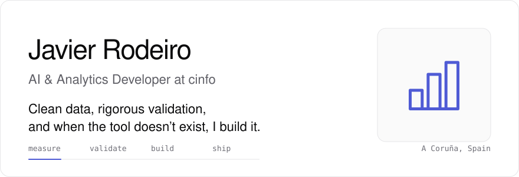
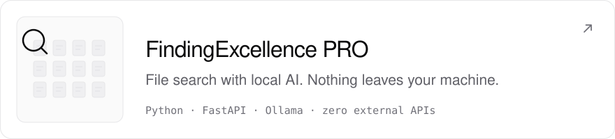
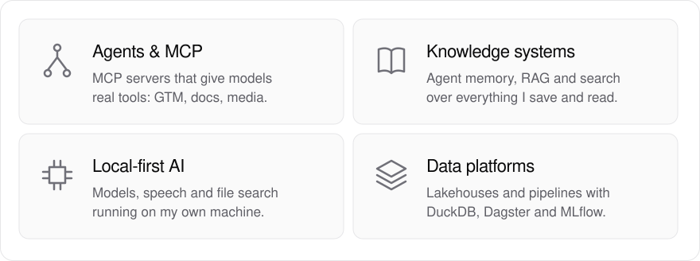
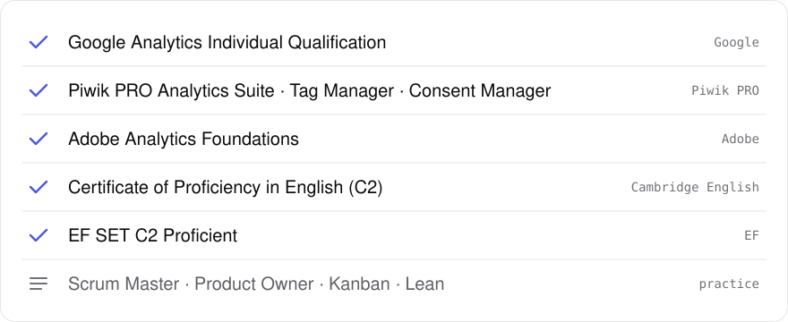

<a href="https://javierrodeiro.com">
  <picture>
    <source media="(prefers-color-scheme: dark)" srcset="assets/hero-dark.svg" />
    
  </picture>
</a>

  <a href="https://javierrodeiro.com">javierrodeiro.com</a> &nbsp;·&nbsp;
  <a href="https://linkedin.com/in/javier-rodeiro-rodriguez">LinkedIn</a> &nbsp;·&nbsp;
  <a href="https://www.linkedin.com/newsletters/puppets-scripts-7290366362223284224/">Puppets &amp; Scripts</a> &nbsp;·&nbsp;
  <a href="mailto:hello@javierrodeiro.com">hello@javierrodeiro.com</a>

At **cinfo** I build AI and analytics solutions on a fully open-source stack. Before that I spent two years running web and app analytics for **PULL&BEAR** (Inditex) at Ayesa, where a Chrome extension I wrote for GA4 validation, OmniZenit, became the tool every Inditex brand's digital analytics team uses. I'm finishing an MSc in Big Data, Data Science & AI at Complutense University of Madrid.

<h3>Selected work</h3>

<a href="https://github.com/Addocu/addocu">
  <picture>
    <source media="(prefers-color-scheme: dark)" srcset="assets/card-addocu-dark.svg" />
    
  </picture>
</a>
<a href="https://github.com/jrodeiro5/SoloDShouse">
  <picture>
    <source media="(prefers-color-scheme: dark)" srcset="assets/card-solodshouse-dark.svg" />
    
  </picture>
</a>
<a href="https://github.com/jrodeiro5/FindingExcellence-PRO">
  <picture>
    <source media="(prefers-color-scheme: dark)" srcset="assets/card-findingexcellence-dark.svg" />
    
  </picture>
</a>
<a href="https://github.com/jrodeiro5/ajazz-deck">
  <picture>
    <source media="(prefers-color-scheme: dark)" srcset="assets/card-ajazz-deck-dark.svg" />
    
  </picture>
</a>

<h3>Now building</h3>

<picture>
  <source media="(prefers-color-scheme: dark)" srcset="assets/focus-dark.svg" />
  
</picture>

<h3>Toolkit</h3>

<picture>
  <source media="(prefers-color-scheme: dark)" srcset="assets/toolkit-dark.svg" />
  
</picture>

<h3>Certifications</h3>

<picture>
  <source media="(prefers-color-scheme: dark)" srcset="assets/credentials-dark.svg" />
  
</picture>

<h3>Activity</h3>

<picture>
  <source media="(prefers-color-scheme: dark)" srcset="assets/activity-dark.svg" />
  
</picture>

<h3>Writing &amp; talks</h3>

**[MeasureCamp Madrid 2025](https://jrodeiro5.github.io/measurecamp_madrid_2025/)** — MCP servers in data & analytics 
**Datola** — *Agile Analysis with AI* series 
**[Puppets & Scripts](https://www.linkedin.com/newsletters/puppets-scripts-7290366362223284224/)** — newsletter on AI, data and building things. Latest:

<!-- BLOG-POST-LIST:START -->
- [How I Built an AI-Native Software for my Macro Pad](https://www.linkedin.com/pulse/how-i-built-ai-native-software-my-macro-pad-javier-rodeiro-rodr%C3%ADguez-pfbhe) · *Mar 2026*
- [Building a Personal Brand Audit Tool with Firecrawl, Gemini and Lovable](https://www.linkedin.com/pulse/building-personal-brand-audit-tool-firecrawl-gemini-javier-roume) · *Jan 2026*
- [You might not care about this: my 2025 ending credits.](https://www.linkedin.com/pulse/you-might-care-my-2025-ending-credits-javier-rodeiro-rodr%C3%ADguez-dr9ie) · *Dec 2025*
- [Análisis Ágiles con IA](https://es.linkedin.com/pulse/an%C3%A1lisis-%C3%A1giles-con-ia-javier-rodeiro-rodr%C3%ADguez-p7aic) · *May 2025*
- [La parábola del Elefante ahora es la del Dragón.](https://es.linkedin.com/pulse/la-par%C3%A1bola-del-elefante-ahora-es-drag%C3%B3n-javier-rodeiro-rodr%C3%ADguez-hxeec) · *Feb 2025*
<!-- BLOG-POST-LIST:END -->

<h3>Path</h3>

**cinfo** — AI & Analytics Developer · 2026– 
**Ayesa** for PULL&BEAR / Inditex — Digital Data Analyst · 2024–2026 
**Bysidecar** — Data Analyst · 2022–2024 
**MSc Big Data, Data Science & AI** — Complutense University of Madrid · 2025–2026 
**Master in Web Analytics** — KSchool · 2023–2024 
**BA Advertising & Public Relations** — San Jorge University · 2018–2022

Spanish and Galician (native) · English (C2) · French (working). Based in A Coruña.

<picture>
  <source media="(prefers-color-scheme: dark)" srcset="assets/signature-dark.svg" />
  
</picture>
