<a href="https://javierrodeiro.com">
  <picture>
    <source media="(prefers-color-scheme: dark)" srcset="assets/profile-dark.svg" />
    
  </picture>
</a>

  <a href="https://javierrodeiro.com">javierrodeiro.com</a> &nbsp;·&nbsp;
  <a href="https://linkedin.com/in/javier-rodeiro-rodriguez">LinkedIn</a> &nbsp;·&nbsp;
  <a href="https://www.linkedin.com/newsletters/puppets-scripts-7290366362223284224/">Puppets &amp; Scripts</a> &nbsp;·&nbsp;
  <a href="mailto:hello@javierrodeiro.com">hello@javierrodeiro.com</a>

