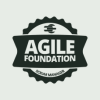

<h1 align="center">Javier Rodeiro</h1>

AI &amp; Analytics Developer at cinfo · A Coruña

  <a href="https://javierrodeiro.com">javierrodeiro.com</a> &nbsp;·&nbsp;
  <a href="https://linkedin.com/in/javier-rodeiro-rodriguez">LinkedIn</a> &nbsp;·&nbsp;
  <a href="https://www.linkedin.com/newsletters/puppets-scripts-7290366362223284224/">Puppets &amp; Scripts</a> &nbsp;·&nbsp;
  <a href="mailto:hello@javierrodeiro.com">hello@javierrodeiro.com</a>

<picture>
  <source media="(prefers-color-scheme: dark)" srcset="assets/stats-dark.svg" />
  
</picture>
 
<picture>
  <source media="(prefers-color-scheme: dark)" srcset="assets/stacks-dark.svg" />
  
</picture>
 
<picture>
  <source media="(prefers-color-scheme: dark)" srcset="assets/about-dark.svg" />
  
</picture>
 

<picture><source media="(prefers-color-scheme: dark)" srcset="assets/certs/t-head-dark.svg" /></picture> <picture><source media="(prefers-color-scheme: dark)" srcset="assets/certs/t-fill25.8-dark.svg" /></picture><picture><source media="(prefers-color-scheme: dark)" srcset="assets/certs/t-snowflake-dark.svg" /></picture><picture><source media="(prefers-color-scheme: dark)" srcset="assets/certs/t-googlebigquery-dark.svg" /></picture><picture><source media="(prefers-color-scheme: dark)" srcset="assets/certs/t-googleanalytics-dark.svg" /></picture><picture><source media="(prefers-color-scheme: dark)" srcset="assets/certs/t-adobe-dark.svg" /></picture><picture><source media="(prefers-color-scheme: dark)" srcset="assets/certs/t-fill25.8-dark.svg" /></picture> <picture><source media="(prefers-color-scheme: dark)" srcset="assets/certs/t-fill19.8-dark.svg" /></picture><picture><source media="(prefers-color-scheme: dark)" srcset="assets/certs/t-scrum-master-dark.svg" /></picture><picture><source media="(prefers-color-scheme: dark)" srcset="assets/certs/t-product-owner-dark.svg" /></picture><picture><source media="(prefers-color-scheme: dark)" srcset="assets/certs/t-agile-foundation-dark.svg" /></picture><picture><source media="(prefers-color-scheme: dark)" srcset="assets/certs/t-kanban-dark.svg" /></picture><picture><source media="(prefers-color-scheme: dark)" srcset="assets/certs/t-lean-dark.svg" /></picture><picture><source media="(prefers-color-scheme: dark)" srcset="assets/certs/t-fill19.8-dark.svg" /></picture> <picture><source media="(prefers-color-scheme: dark)" srcset="assets/certs/t-cambridge-c2-dark.svg" /></picture> <picture><source media="(prefers-color-scheme: dark)" srcset="assets/certs/t-pad-dark.svg" /></picture>

 
<picture>
  <source media="(prefers-color-scheme: dark)" srcset="assets/milestones-dark.svg" />
  
</picture>
