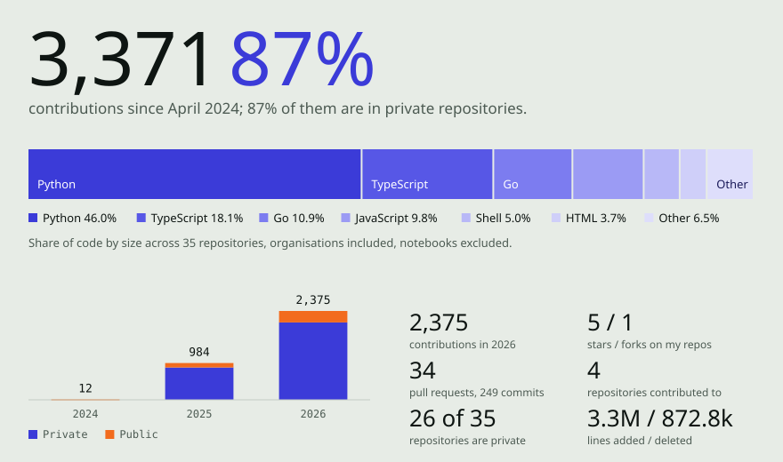
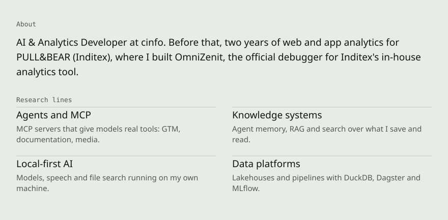

<h1 align="center">Javier Rodeiro</h1>

AI &amp; Analytics Developer at cinfo · A Coruña

  <a href="https://javierrodeiro.com">javierrodeiro.com</a> &nbsp;·&nbsp;
  <a href="https://linkedin.com/in/javier-rodeiro-rodriguez">LinkedIn</a> &nbsp;·&nbsp;
  <a href="https://www.linkedin.com/newsletters/puppets-scripts-7290366362223284224/">Puppets &amp; Scripts</a> &nbsp;·&nbsp;
  <a href="mailto:hello@javierrodeiro.com">hello@javierrodeiro.com</a>

<picture>
  <source media="(prefers-color-scheme: dark)" srcset="assets/stats-dark.svg" />
  
</picture>
 
<picture>
  <source media="(prefers-color-scheme: dark)" srcset="assets/stacks-dark.svg" />
  
</picture>
 
<picture>
  <source media="(prefers-color-scheme: dark)" srcset="assets/about-dark.svg" />
  
</picture>
 
<picture>
  <source media="(prefers-color-scheme: dark)" srcset="assets/milestones-dark.svg" />
  
</picture>
